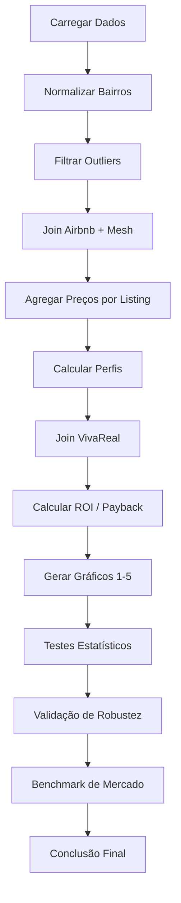

# 📊 Análise BI: Recomendação de Investimento em Itapema/SC

**Seazone - Jovens Talentos AI Builder 2026**

---

## 📦 Links de Entrega

| Recurso | Link |
|---|---|
| 🎥 **Vídeo de Apresentação (3 min)** | [Assistir no Google Drive](https://drive.google.com/drive/folders/1lO0B6q-WRIN50fRkYvJVviMuy3KJ7wkT) |
| 📊 **Slides da Apresentação** | [Abrir no Google Slides](https://docs.google.com/presentation/d/1WcFX03gxMfteuEpuYA-i50BdWLb8srsr/edit?slide=id.p1#slide=id.p1) |
| 📄 **Relatório Completo (PDF)** | [Ler no Google Drive](https://drive.google.com/drive/folders/1twuhm94CQyTEFm_73_02oBHCa6eMB3n0) |


---

## 📌 Índice

1. [Sobre o Projeto](#-sobre-o-projeto)
2. [Objetivo do Desafio](#-objetivo-do-desafio)
3. [Perguntas de Negócio Respondidas](#-perguntas-de-negócio-respondidas)
4. [Conclusão Principal](#-conclusão-principal)
5. [Metodologia](#-metodologia)
6. [Pipeline de Análise](#-pipeline-de-análise)
7. [Resultados Detalhados](#-resultados-detalhados)
8. [Validação Estatística](#-validação-estatística)
9. [Validação de Robustez](#-validação-de-robustez)
10. [Benchmark com Mercado Real](#-benchmark-com-mercado-real)
11. [AI First - Uso de Inteligência Artificial](#-ai-first---uso-de-inteligência-artificial)
12. [Estrutura do Repositório](#-estrutura-do-repositório)
13. [Como Reproduzir](#-como-reproduzir)
14. [Limitações](#-limitações)
15. [Autores](#-autores)

---

## 🎯 Sobre o Projeto

Projeto desenvolvido para o processo seletivo **"Jovens Talentos AI Builder 2026"** da **Seazone** (empresa **AI First**, 3.000+ imóveis de short stay no Brasil). O objetivo é analisar dados reais de **Airbnb** e **VivaReal** para recomendar o **melhor investimento imobiliário** em **Itapema/SC**, voltado a **aluguel por temporada (short-term rental)**.

### 📊 Dados Utilizados

| Arquivo | Descrição | Registros |
|---|---|---|
| `Details_Itapema.csv` | Anúncios Airbnb (características, reviews, notas) | 4.441 |
| `Price_AV_Itapema.csv` | Preço por noite (jan-abr/2025) | ~118 mil linhas |
| `Mesh_Ids_Data_Itapema.csv` | Bairro e coordenadas | 4.441 (join 1:1) |
| `Hosts_ids_Itapema.csv` | Perfil dos anfitriões | 4.440 (3.057 únicos) |
| `VivaReal_Itapema.csv` | Ofertas de venda | 8.329 |

---

## 🎯 Objetivo do Desafio

Analisar os dados para recomendar o **melhor perfil de imóvel** e a **melhor localização** para a Seazone investir em Itapema, respondendo:

1. Qual o melhor perfil de imóvel? (Studio/1q, 2q, 3q+)
2. Qual a melhor localização?
3. Quais características explicam a receita?
4. Qual a recomendação de compra?
5. A tese dos **compactos no Centro** se sustenta?(tese interna da Seazone)

---

## 📋 Perguntas de Negócio Respondidas

| Pergunta | Resposta | Detalhe |
|---|---|---|
| **Qual o melhor perfil?** | **Studio/1q** | ROI 10,8%, payback 9,3 anos, entrada R$ 890 mil |
| **Qual a melhor localização?** | **Centro** | ADR premium (R$ 595), ROI 9,8% entre bairros consolidados |
| **O que explica a receita?** | **Tamanho do imóvel** | quartos ρ=0,60; qualidade percebida não explica preço |
| **Qual a recomendação?** | **Comprar Studio/1q no Centro** | ROI 11,1%, payback 9,0 anos, R$ 890 mil |
| **A tese se sustenta?** | **Sim, com ressalvas** | melhor ROI (11,1%), porém estoque escasso (21 un.) |

---

## 🏆 Conclusão Principal

> **Comprar Studio/1q no Centro** — ROI anual de **11,1%** (cenário 60% de ocupação), payback de **9,0 anos**, investimento de **R$ 890 mil**. O fallback é o **2q no Centro** (ROI 10,8%, com 4x mais oferta).


---

## 🔬 Metodologia

### 1. Coleta e Preparação de Dados

| Etapa | Descrição | Detalhes |
|---|---|---|
| **Carregamento** | Leitura dos 5 CSVs | `pandas.read_csv()` |
| **Normalização** | Bairros sem acentos, case-insensitive | `norm_suburb()` |
| **Join** | Airbnb + Mesh (bairro/coordenadas) | `merge()` por `airbnb_listing_id` (1:1) |
| **Filtro de outliers** | Preços de diária > R$ 5.000 | removidos (ruído de cadastro) |
| **Filtro VivaReal** | Área útil > 1.500 m² | removidos (área suja: até 188 mil m²) |
| **Perfis** | Studio/1q, 2q, 3q+ | `bucket_bedrooms()` |

### 2. Cálculo de Métricas

| Métrica | Fórmula | Observação |
|---|---|---|
| **ADR** | `price.mean()` por listing | Preço médio por noite |
| **Receita anual (60%)** | `ADR × 365 × 0,60` | Cenário conservador (mercado: ~64%) |
| **ROI** | `Receita ÷ Preço de compra` | Usa **mediana** do VivaReal (robusta) |
| **Payback** | `Preço de compra ÷ Receita` | Anos aproximados de retorno |

### 3. Diagnóstico de Exclusão (999 → 972)

Dos 999 anúncios com preço na interseção Prices×Details, **27 foram excluídos**:
- **3** por terem apenas preços-outlier (> R$ 5.000);
- **24** por não terem oferta de apartamento à venda no VivaReal na combinação bairro × perfil (bairros periféricos sem mercado de venda, ou onde o VivaReal só anuncia casas/terrenos). Nenhum erro de normalização; sem viés para a recomendação (nenhum bairro-âncora afetado).

**Diagnóstico detalhado:** [`analise_bi_final.md` §1.1](analise_bi_final.md) · script [`diagnostico_exclusao.py`](scripts/diagnostico_exclusao.py)

---

## 🚀 Pipeline de Análise



---

## 📊 Resultados Detalhados

### Melhor Perfil de Imóvel


| Perfil | Anúncios | ADR Mediana | Receita Anual (60%) | ROI | Payback |
|---|---|---|---|---|---|
| **Studio/1q** | 136 | R$ 434 | R$ 95.034 | **10,8%** | **9,3 anos** |
| 2q | 345 | R$ 483 | R$ 105.871 | 10,7% | 9,3 anos |
| 3q+ | 491 | R$ 736 | R$ 161.123 | 6,6% | 15,3 anos |

**Insight:** o melhor perfil é o **compacto (Studio/1q)**: mesmo ROI do 2q com **menor capital inicial (R$ 890 mil vs R$ 1,075 milhão)**. O 3q+ dobra a receita, mas o preço de compra (R$ 2,5M+) derruba a eficiência para 6,6% — metade do ROI, mais que o dobro do payback.

### Melhor Localização


| Bairro | Anúncios | ADR Mediana | ROI | IC 95% (bootstrap) |
|---|---|---|---|---|
| Tabuleiro Dos Oliveiras | 20 | R$ 609 | 16,2% | [12,1% – 20,0%] |
| Morretes | 82 | R$ 495 | 13,3% | [12,2% – 15,3%] |
| Casa Branca | 13 | R$ 377 | 12,6% | [9,3% – 14,9%] |
| **Centro** | 205 | R$ 595 | **9,8%** | [9,5% – 10,7%] |
| Canto Da Praia | 9 | R$ 670 | 9,3% | [7,6% – 22,4%] |
| Meia Praia | 630 | R$ 623 | 7,4% | [7,1% – 7,8%] |
| Ilhota | 6 | R$ 552 | 6,5% | [4,3% – 34,1%] |

**Insight:** o **Centro** é a localização mais eficiente entre bairros consolidados — ADR premium + ROI 9,8% + 20,6% dos anúncios. **Atenção:** bairros com n < 20 têm IC amplos e não devem ancorar decisão. A **Meia Praia** (63% da oferta) tem o pior ROI entre os grandes (7,4%) porque a compra é cara.

### O que Explica a Receita


| Característica | ρ (Spearman) | Impacto |
|---|---|---|
| Nº de quartos | **+0,60** | Forte positivo |
| Nº de banheiros | +0,55 | Forte positivo |
| Capacidade (hóspedes) | +0,52 | Forte positivo |
| Taxa de limpeza | +0,42 | Moderado |
| Nº de camas | +0,39 | Moderado |
| Nº de fotos | +0,20 | Fracamente positivo |
| Nota de localização | +0,19 | Fracamente positivo |
| Nota média | +0,08 | Quase nulo |
| Superhost | -0,09 | Negativo (quase nulo) |
| Guest favorite | -0,10 | Negativo (quase nulo) |
| Nº de reviews | **-0,18** | **Negativo** |

**Insight contraintuitivo:** qualidade percebida (**reviews, nota, superhost, guest favorite**) **não explica o preço** — a correlação de reviews é até **negativa (-0,18)**. Em Itapema, **"o preço define a demanda"** (anúncios caros atraem poucos reviews). O que precifica é a **estrutura física** (quartos, banheiros, capacidade), o que **reforça a tese dos compactos**.

### Tese dos Compactos no Centro

| Combinação | ROI | Receita Anual (60%) | Preço Compra | Payback |
|---|---|---|---|---|
| **Studio/1q — Centro** | **11,07%** | R$ 98.539 | R$ 890.000 | 9,0 anos |
| 2q — Centro | 10,78% | R$ 126.139 | R$ 1.170.000 | 9,3 anos |
| Studio/1q — Meia Praia | 10,36% | R$ 90.918 | R$ 877.500 | 9,7 anos |
| 2q — Meia Praia | 9,93% | R$ 106.755 | R$ 1.075.000 | 10,1 anos |
| (referência) 3q+ | 6,6% | — | R$ 2,5–2,8M | ~15,3 |

**Veredito:** a tese **se sustenta** — Studio/1q no Centro tem o melhor ROI (11,07%). Porém, a vantagem sobre o 2q é **marginal** (≈0,3 p.p.) e o estoque de studio no Centro é **escasso** (21 unidades no VivaReal). **Fallback:** 2q no Centro (10,78%, 88 unidades).

Extras: [Payback por perfil](graficos/grafico4_payback_perfil.png) · [Sazonalidade do ADR](graficos/grafico6_sazonalidade.png)

---

## 📊 Validação Estatística

### Studio/1q vs 2q (perfil)

| Teste | Estatística | p-valor | Conclusão |
|---|---|---|---|
| t de Student (Welch) | t = 0,375 | 0,708 | Não significativo |
| Mann-Whitney U | U = 24.497 | 0,450 | Não significativo |
| Bootstrap da diferença | +0,16 p.p. | IC [-0,89; +1,60] | Contém o zero |

**Conclusão:** empatados estatisticamente — o que diferencia os compactos é o **menor capital inicial**.

### Centro vs Meia Praia (Studio/1q, localização)

| Teste | Estatística | p-valor | Conclusão |
|---|---|---|---|
| t de Student (Welch) | t = 3,078 | 0,003 | Significativo |
| Mann-Whitney U | U = 2.123 | 0,018 | Significativo |
| Bootstrap da diferença | +0,77 p.p. | IC [-0,95; +4,60] | Contém o zero |

**Conclusão honesta:** a vantagem do Centro é **direcional e consistente**, mas **não conclusiva em mediana** (amostra pequena da Meia Praia, n=41) — o que reforça o fallback do 2q no Centro.

---

## 🛡️ Validação de Robustez

| Variação | Studio/1q Centro | 2q Centro | 3q+ (geral) |
|---|---|---|---|
| Base (cap 5k, mediana, 60%) | 11,07% | 10,78% | 6,56% |
| Cap de outliers R$ 3.000 | 11,07% | 10,78% | 6,55% |
| Preço de compra médio | 11,13% | 10,56% | 4,99% |
| Ocupação de 55% | 10,15% | 9,88% | 6,01% |

**Conclusão:** a recomendação **permanece válida em todos os cenários** — a ordem de eficiência (Studio/1q ≥ 2q >> 3q+) é **estável**.

---

## 📈 Benchmark com Mercado Real

| Fonte | Métrica | Mercado | Projeto | Convergência |
|---|---|---|---|---|
| MySide 2025 | Rentabilidade anual Itapema | 17% a.a. | 10,8% + valorização ~6% ≈ **17%** | ✅ |
| Viver em SC | Diária média | R$ 540 | R$ 595 (Centro) / R$ 434 (Studio) | ✅ |
| Viver em SC | Ocupação média | 64% | 60% (conservador) | ✅ |
| Viver em SC | Yield líquido | 8,8–9,6% | 10,8% (bruto) | ✅ |

**Insight:** o projeto está **calibrado com o mercado real** — a diferença entre ROI bruto (10,8%) e yield líquido de mercado (8,8–9,6%) é explicada pelos custos operacionais (~1–2 p.p.).

---

## 🤖 AI First - Uso de Inteligência Artificial

Projeto desenvolvido com **mentalidade AI First** (valor central da Seazone), usando o modelo **DeepSeek-V4-Flash** (`hub/deepseek-v4-flash`) com **chave API cedida pela Seazone**.

### Especificações do Modelo

| Atributo | Especificação |
|---|---|
| Modelo | `deepseek-v4-flash` |
| Arquitetura | Mixture-of-Experts (MoE) com atenção esparsa (CSA + HCA) |
| Parâmetros totais | 284B (304B com módulo de decodificação especulativa) |
| Parâmetros ativos | ~13B por token |
| Janela de contexto | ~1M tokens |
| Saída máxima | ~393K tokens |
| Modos de raciocínio | Non-Think, Think High, Think Max |
| Precisão | FP4 (expert) + FP8 (não-expert) |
| Licença | MIT |

*(Especificações de domínio público do fornecedor — ver nota de transparência no relatório §1.3.)*

### Como a IA Foi Usada

| Etapa | Uso da IA | Resultado |
|---|---|---|
| Exploração de dados | Estratégias de EDA e verificação de joins | `exploracao_inicial.py`, `relacionamentos_insights.py` |
| Limpeza de dados | Filtros de outliers, mediana | base de 972 anúncios |
| Análise estatística | Testes t, Mann-Whitney, bootstrap | §2.5 e §6.4.1 |
| Geração de gráficos | Criação em 300 DPI com paleta consistente | 6 gráficos em `graficos/` |
| Diagnóstico 999→972 | Script de transparência | `diagnostico_exclusao.py` |
| Validação de robustez | Teste de premissas | `analise_bi_robustez.py` |
| Benchmark de mercado | Referências externas (MySide, Viver em SC, Otimizza) | §9.1 |
| Redação do relatório | Estruturação, clareza e didática | `analise_bi_final.md` |

### Uso Estratégico (não como "caixa preta")

1. **Autonomia humana:** decisões finais humanas (ex.: teste Centro × Meia declarado *não conclusivo em mediana*);
2. **Iteração:** múltiplas revisões com feedback (ex.: linha de referência do gráfico 5 corrigida);
3. **Pensamento crítico:** modelo questionado e validado com scripts independentes;
4. **Foco em fatos:** insights baseados em dados, sem fabricação de conclusões;
5. **Raciocínio configurável:** **Think High** nas tarefas analíticas e **Non-Think** nas operacionais.

**Conversas completas em texto:** [`ai-log/registro-ai.md`](ai-log/registro-ai.md)

---

## 📂 Estrutura do Repositório

```
repo/
├── data/                         # Dados brutos (5 CSVs)
├── scripts/                      # Scripts Python (7)
│   ├── exploracao_inicial.py
│   ├── relacionamentos_insights.py
│   ├── analise_tese_compactos.py
│   ├── analise_bi_graficos.py
│   ├── analise_bi_correcoes.py
│   ├── diagnostico_exclusao.py
│   └── analise_bi_robustez.py
├── graficos/                     # Gráficos PNG (300 DPI)
│   ├── grafico1_roi_perfil.png
│   ├── grafico2_roi_bairro.png
│   ├── grafico3_correlacoes_adr.png
│   ├── grafico4_payback_perfil.png
│   ├── grafico5_tese_compactos.png
│   └── grafico6_sazonalidade.png
├── metricas/                     # Métricas e tabelas de apoio (CSV)
├── ai-log/                       # Conversas com IA (texto)
│   └── registro-ai.md
├── analise_bi_final.md           # Relatório BI completo
├── analise_tese_compactos.md     # Análise da tese dos compactos
├── analise_inicial.md            # Análise exploratória inicial
├── requirements.txt              # Dependências
└── README.md                     # Este arquivo
```

---

## 🚀 Como Reproduzir

### 1. Instalar dependências

```bash
pip install -r requirements.txt
```

### 2. Executar os scripts (em ordem)

```bash
python scripts/exploracao_inicial.py        # EDA inicial
python scripts/relacionamentos_insights.py  # joins e insights
python scripts/analise_tese_compactos.py    # tese dos compactos
python scripts/analise_bi_graficos.py       # gráficos 1-5 + métricas
python scripts/analise_bi_correcoes.py      # sensibilidade, testes, IC, gráfico 6
python scripts/diagnostico_exclusao.py      # diagnóstico 999 -> 972
python scripts/analise_bi_robustez.py       # robustez + teste Centro x Meia Praia
```

> Todos os scripts leem de `data/` e gravam em `graficos/` (PNGs) e `metricas/` (CSVs).

### 3. Visualizar resultados

- **Relatório completo:** [`analise_bi_final.md`](analise_bi_final.md)
- **Gráficos:** `graficos/*.png` (300 DPI)
- **Métricas:** `metricas/*.csv`

---

## ⚠️ Limitações

1. **Janela de dados curta** — apenas 4 meses (jan–abr/2025), concentrados na alta temporada;
2. **Ocupação assumida (60%)** — os dados são de *preço*, não de reservas; sensibilidade em §6.6;
3. **ROI bruto** — não deduz condomínio, IPTU, limpezza e gestão;
4. **Preços de compra** — mediana de anúncios do VivaReal, não transações efetivas;
5. **Bairros com n < 20** possuem IC amplos e não devem ancorar decisão.

---

## 👥 Autores

**Projeto:** Alex Oliveira
**Desafio:** Seazone - Jovens Talentos AI Builder 2026
**Repositório:** `jt2026-alex-oliveira`
**Data:** Agosto/2026

---

## 📄 Licença

Projeto desenvolvido para fins educacionais e de avaliação no processo seletivo da Seazone. Os dados são de domínio público/snapshot do mercado e pertencem aos respectivos proprietários (Airbnb, VivaReal/GRUPOZAP).

---

**✨ Projeto desenvolvido com 🧠 e AI First.**