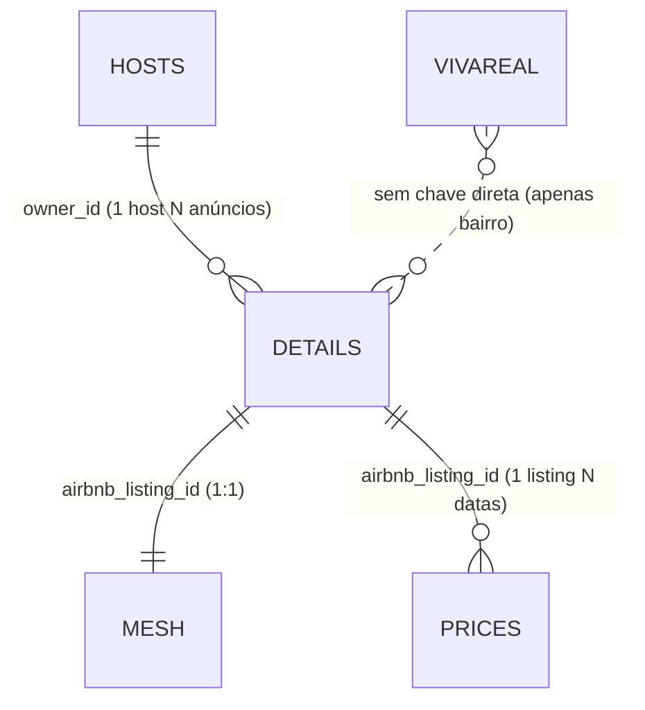

# Análise Inicial dos Dados - Seazone Hackathon

> Exploracao v1 - foco: estrutura, qualidade e relacionamento entre os 5 arquivos.
> Itapema/SC - mercado de short-term rentals (Airbnb) e compra (VivaReal).

## Resumo Geral
- Total de arquivos: 5
- Total de anúncios Airbnb (Details): **4.441**
- Total de anúncios de venda (VivaReal): **8.329**
- Cobertura de preços (Price_AV): apenas **1.005 listings** (~22% do Details)

| Arquivo | Linhas | Colunas | Chave |
|---|---|---|---|
| Details_Itapema.csv | 4.441 | 35 | `airbnb_listing_id` |
| Hosts_ids_Itapema.csv | 4.440 | 11 | `owner_id` |
| Mesh_Ids_Data_Itapema.csv | 4.441 | 8 | `airbnb_listing_id` |
| Price_AV_Itapema.csv | 118.839 | 4 | `airbnb_listing_id` + `date` |
| VivaReal_Itapema.csv | 8.329 | 22 | `listing_id` |

---

## Estrutura dos Arquivos

### 1. Details_Itapema.csv — base de anúncios Airbnb
- Linhas: 4.441 | Colunas: 35
- Chave primária: `airbnb_listing_id` (único, sem duplicadas)
- Descrição: Anúncio individual de locação por temporada: título, descrição, comodidades, nº de quartos/banheiros/camas, capacidade, reviews, ratings, cleaning fee, tipo de imóvel, host, data de captura.
- Colunas: `airbnb_listing_id`, `url`, `ad_name`, `ad_description`, `space`, `house_rules`, `amenities`, `safety_features`, `number_of_bathrooms`, `number_of_bedrooms`, `number_of_beds`, `latitude`, `longitude`, `check_in`, `check_out`, `number_of_guests`, `number_of_reviews`, `cleaning_fee`, `owner_id`, `aquisition_date`, `star_rating`, `picture_count`, `min_nights`, `guest_satisfaction_overall`, `listing_type`, `can_instant_book`, `is_professional`, `accuracy_rating`, `checkin_rating`, `cleanliness_rating`, `communication_rating`, `location_rating`, `value_rating`, `is_new_listing`, `is_guest_favorite`
- Valores nulos (principais):
  - `space` (2.527), `check_out` (842), `check_in` (446), `can_instant_book` (355), `is_professional` (355), `is_new_listing` (874), `ad_description` (54)
- Observação crítica: `latitude`/`longitude` estão **todas = 0** → coordenadas reais vêm de `Mesh`.
- `owner_id` → FK para Hosts. `airbnb_listing_id` → FK para Mesh/Prices.

### 2. Hosts_ids_Itapema.csv — anfitriões
- Linhas: 4.440 | Colunas: 11
- Chave primária: `owner_id`
- Descrição: Perfil do anfitrião: nome, superhost, nº de reviews, verificação, rating, tempo como host (anos/meses), taxa/time de resposta.
- Colunas: `owner_id`, `owner`, `is_superhost`, `number_of_reviews_host`, `is_verified`, `star_rating_host`, `years_host`, `months_host`, `response_rate_shown`, `response_time_shown`, `host_snapshot_date`
- Valores nulos: `response_rate_shown` e `response_time_shown` **100% nulos** (4.440/4.440) → não utilizáveis.
- Observações: 20% são superhost; 854 hosts sem nenhum review registrado; `number_of_reviews_host` com outliers (máx. 41.299) — provável host profissional com acúmulo de reviews.

### 3. Mesh_Ids_Data_Itapema.csv — localização
- Linhas: 4.441 | Colunas: 8
- Chave primária: `airbnb_listing_id` (recebe 1:1 com Details)
- Descrição: Geolocalização e bairro de cada anúncio — **fonte oficial das coordenadas**.
- Colunas: `airbnb_listing_id`, `latitude`, `longitude`, `suburb`, `country`, `state`, `city`, `aquisition_date`
- Valores nulos: nenhum.
- Observações: join 1:1 perfeito com Details (4.441 ↔ 4.441, 100% de cobertura). Bairros: Meia Praia (2.860), Centro (657), Morretes (441), entre outros.

### 4. Price_AV_Itapema.csv — preços por data
- Linhas: 118.839 | Colunas: 4
- Chave: `airbnb_listing_id` + `date` (1:N com Details; muitas linhas por listing)
- Descrição: Preço por noite de cada anúncio, por data de estadia, com data de captura (AV = availability).
- Colunas: `airbnb_listing_id`, `date`, `price`, `aquisition_date`
- Valores nulos: nenhum.
- Observações críticas:
  - Cobrem apenas **1.005 listings únicos** (999 deles estão no Details; 6 não estão).
  - **~77% dos anúncios do Details não têm preço** → análises de receita ficam restritas a esse subconjunto.
  - Janela de datas curta: 2025-01-06 a 2025-04-20 (~3,5 meses).
  - Outlier extremo: preço máx. de R$ 29.000/noite; média ~R$ 713, mediana ~R$ 607.

### 5. VivaReal_Itapema.csv — mercado de venda
- Linhas: 8.329 | Colunas: 22
- Chave primária: `listing_id` (36 duplicadas no campo → 35 linhas duplicadas exatas)
- Descrição: Oferta de imóveis à venda: preço, condomínio, IPTU, área útil, quartos/banheiros/vagas, bairro, vendedor.
- Colunas: `listing_id`, `link_url`, `listing_title`, `business_types`, `listing_type`, `property_type`, `sale_price`, `rental_price`, `rental_period`, `yearly_iptu`, `monthly_condo_fee`, `amenities`, `usable_area`, `bathrooms`, `bedrooms`, `parking_spaces`, `state`, `city`, `suburb`, `advertiser_name`, `portal`, `aquisition_date`
- Valores nulos: `rental_price` e `rental_period` (~100% nulos — não dá p/ usar locação daqui); `yearly_iptu` (2.714), `monthly_condo_fee` (2.490), `suburb` (98), `state` (2).
- Observações: 100% `property_type = UNIT`; `listing_type`: 7.529 apartamentos, 547 casas, 164 terrenos, 79 comercial, 10 outros. Convenção `suburb` diverge do Mesh ("Meia praia" vs "Meia Praia", "Alto São Bento" com acento) → normalizar antes de cruzar.

---

## Relacionamentos (JOINs)



| Origem | Destino | Coluna-chave | Tipo | Cobertura |
|---|---|---|---|---|
| Details | Mesh | `airbnb_listing_id` | 1:1 | 100% (4.441/4.441) |
| Details | Hosts | `owner_id` | N:1 | 100% (3.057 hosts) |
| Details | Prices | `airbnb_listing_id` | 1:N | 22,5% (999/4.441) |
| VivaReal | Details | — (ausente) | por `suburb` | aproximado |

- **Chaves primárias:** `airbnb_listing_id` (Details/Mesh/Prices), `owner_id` (Hosts), `listing_id` (VivaReal).
- **Chaves estrangeiras:** `owner_id` (Details → Hosts), `airbnb_listing_id` (Prices/Mesh → Details).
- **Não há chave comum entre VivaReal e Airbnb**: o cruzamento compra × locação precisa ser feito por bairro/tipologia.

---

## Qualidade dos Dados

**Maiores problemas de valores faltantes**
1. `Hosts.response_rate_shown` / `response_time_shown` → 100% ausentes.
2. `VivaReal.rental_price` / `rental_period` → ~100% ausentes.
3. `Details.space` (57%), `is_new_listing` (20%), `check_out` (19%).
4. `VivaReal.yearly_iptu` / `monthly_condo_fee` (~30%).
5. `details.star_rating == 0` em 1.540 anúncios (35%) — sem avaliação, não é "mal avaliado".

**Outliers óbvios**
- `Price_AV.price`: R$ 29.000/noite (fura o teto de forma absurda) → tratar (cap ou remover).
- `VivaReal.sale_price`: 147 anúncios > R$ 10M (máx. R$ 44M).
- `VivaReal.usable_area`: 42 anúncios > 1.500 m² (máx. 188.000 m² → dado sujo).
- `Hosts.number_of_reviews_host`: até 41.299 (hosts de grande escala).

**Inconsistências / armadilhas**
- `Details.latitude/longitude` todas zero → usar Mesh (ou, como vêm do mesmo snapshot, ambas as fontes têm datas de aquisição distintas).
- Cobertura de preços parcial e só 3,5 meses → cuidado ao generalizar receita anual.
- Normalização de bairro necessária para cruzar Airbnb × VivaReal.

---

## Primeiros Insights

1. **Tipo de imóvel mais comum:** apartamento — 3.710 de 4.441 anúncios (83,5%), seguido de casa (443), outros (245), hotel (43).
2. **Faixa de preço média (por noite):** média ~R$ 695, mediana ~R$ 598/listing (Price_AV). Distribuição concentrada entre R$ 434 e R$ 779 (P25–P75).
3. **Tipologia dominante:** 2 e 3 quartos (1.482 + 1.922 = 76% dos anúncios); 1 quarto = 549; studios/0 quarto = 56. Capacidade média de 6,6 hóspedes.
4. **Bairros (Airbnb):** Meia Praia concentra 64% (2.860) dos anúncios; Centro 657 (15%); Morretes 441.
5. **Cobertura de preços:** só 22% dos anúncios têm série de preço — e em janela de ~3,5 meses —, o que limita estimativas de ocupação/receita a esse subconjunto.
6. **status:** 35% dos anúncios são novos (`is_new_listing` True, 731) ou sem dado (874); 389 anúncios são profissionais.
7. **Hosts profissionais são minoria (8,8% dos anúncios),** mas superhosts representam 20% dos hosts.

### Implicação para o caso de negócio
A tese "apartamentos compactos (studio/1 quarto) no Centro" precisa ser testada dentro do subconjunto com preços (999 listings). Os dados permitem medir: preço médio/mediano por bairro × tipologia, qualidade do anúncio (ratings, superhost) e, com o VivaReal, custo de aquisição por bairro — o combo necessário para estimar retorno. A próxima etapa é construir receita/m² por bairro e tipologia e confrontar a tese.

---

## Como reproduzir

```bash
pip install pandas numpy matplotlib seaborn
python scripts/exploracao_inicial.py        # Tarefa 1 - estrutura de cada arquivo
python scripts/relacionamentos_insights.py  # Tarefas 2 e 3 - joins e insights
```